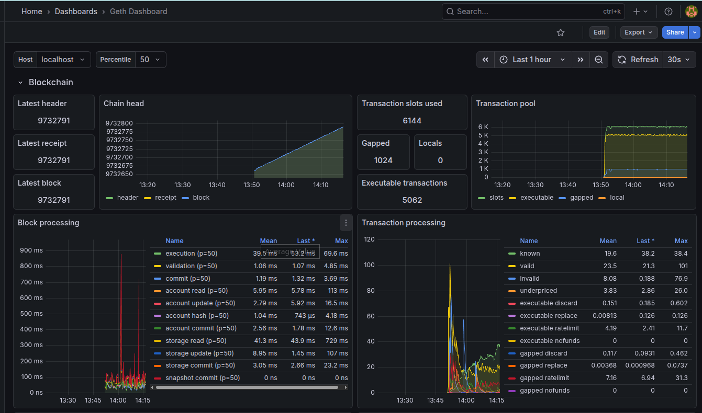
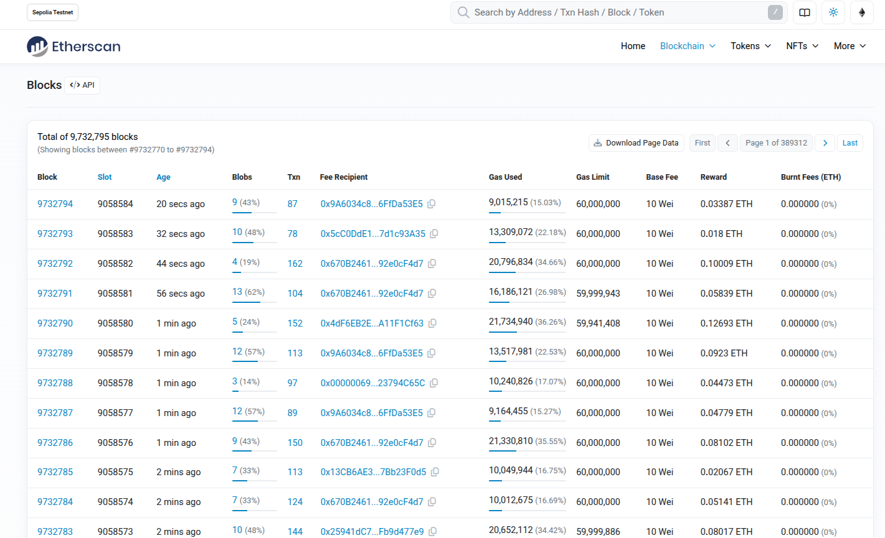

# Web3 Nodes Infrastructure

Terraform configuration for provisioning blockchain nodes on Contabo VPS instances. Currently set up for Ethereum (Geth) nodes, but the module can be extended for other chains.

## What's in here

- **`terraform-modules/contabo-instance/`** - Reusable Terraform module for creating Contabo VPS instances
- **`nodes/`** - Infrastructure configuration that uses the module to spin up actual nodes
- **`nodes/user-data/`** - Cloud-init scripts that run on instance startup to configure the nodes

## Node Sync Verification

The Geth node is fully synced with the Ethereum Sepolia testnet. The screenshots below demonstrate that our node's latest block matches the current chain head on Etherscan.

### Geth Dashboard (Grafana)

The Grafana dashboard shows the node synced to block **9732791**, with real-time metrics for chain head progression, transaction pool status, and block/transaction processing performance.

### Etherscan Sepolia Blocks

Etherscan confirms block **9732791** as part of the current chain, verifying our node is up to date.

## Monitoring Stack

The Geth client is configured with **Grafana** and **InfluxDB** for comprehensive node monitoring. This stack provides:

- Real-time visibility into block synchronization progress
- Transaction pool metrics (pending, queued, executable transactions)
- Block and transaction processing performance (execution, validation, commit times)
- Historical data retention for trend analysis and alerting
